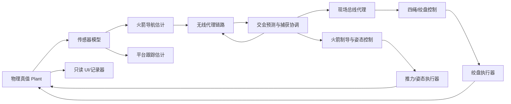

# 系统架构设计

## 目标边界

研究终端回收阶段的协同闭环，不模拟完整入轨、再入热环境和发动机内部过程。第一版采用 6DoF 刚体与四根 Kelvin–Voigt 等效阻拦索；分段柔性绳和约束 MPC 留作后续可替换实现。

## 数据与控制流



控制器看不到真值；UI 可以同时显示真值与估计值，但没有控制写权限。

## 模块职责

- `engine`：整数 tick、确定性调度、随机数、记录和重放。
- `plant`：火箭刚体、平台运动、环境、绳索、接触和执行器。
- `sensors`：测量采样、噪声、偏差、失效和量测时间戳。
- `comms`：编码、CRC、时延队列、带宽、丢包、乱序、重复和过期拒绝。
- `estimation`：α–β 基线与常加速度 Kalman 预测模式。
- `control`：火箭终端制导、网中心/半间距控制、接触后张力控制。
- `supervisor`：`SEARCH → TRACK → SYNC → ARMED → CLOSING → CONTACT → ARREST → SECURED`，以及 `ABORT/MISSED/BROKEN`。
- `metrics`：脱靶、相对速度、姿态、张力、表观载荷、链路和成功率。

## 模拟协议

外部可见消息至少包含：

```text
version, source, destination, type, sequence,
producedTick, expiresTick, payload, crc32
```

火箭上行：`HEARTBEAT`、`VEHICLE_STATE`、`CAPTURE_READY`。

平台下行：`CAPTURE_PLAN`、`PREPARE`、`COMMIT`、`ABORT`。

现场总线：`WINCH_COMMAND`、`WINCH_STATUS`、`TENSION_STATUS`。

迟到、重复、CRC 错误或过期命令必须被拒绝并计数。实际协议未公开，本协议仅为候选实现。

## 默认多速率

- 物理与接触：500 Hz（2 ms）。
- 传感器与火箭控制：100 Hz。
- 网/绞盘控制：100 Hz。
- 无线遥测与捕获计划：20 Hz。
- 现场总线：100 Hz。
- UI 快照：30 Hz。

所有周期都是基础 tick 的整数倍；显示掉帧不得改变物理步长。

## 状态所有权

- 仿真内核唯一拥有真值。
- 火箭节点拥有导航估计、飞控命令和本地安全状态。
- 平台跟踪器拥有目标估计与协方差。
- 捕获协调器拥有捕获窗口和双端握手。
- 网控拥有四绳位置、速度、张力与绞盘状态。
- 通信模块拥有序号、队列、超时、CRC 与统计。
- 每条控制量必须保留 `desired` 与 `applied`。

